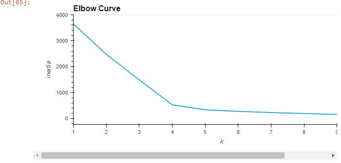
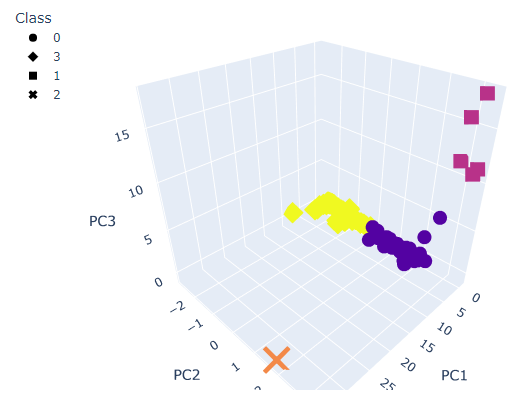
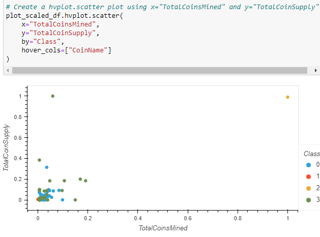

# Cryptocurrencies

## Purpose
Here, we use unsupervised machine learning's clustering algorithms to attempt to classify cryptocurrencies into groups.  We plan to visualize these groupings to present to help inform the decisions of potential investors.

To this end, we use PCA to reduce the dimmensions of our data, we use K-means and an elbow curve to cluster our data, and we use both 2D and 3D scatter plots to visualize our data.

## Results

After applying the PCA algorithm and fitting our data, we end up with this elbow curve.

It is clear by the sharp change in slope that our k-value, then, will be 4.  This means 4 clusters across 3 features, visualized in the 3-dimmensional graph below.

With our data cleaned, scaled, and compiled, we can graph a scatter plot showing our class groupings as coins mined versus coin supply.  

